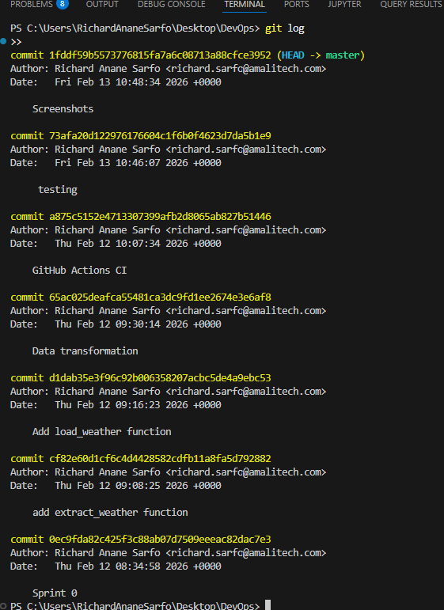

# Sprint 1 Review – Weather ETL Pipeline

**Sprint Goal**  
Deliver a working basic ETL pipeline: extract weather data from Open-Meteo API and load it into SQLite.

**Completed Stories**  
- US01 – Extract daily weather data (7 days, Kumasi)  
- US02 – Load raw data into SQLite table `weather`

**Definition of Done met**  
- Code committed incrementally  
- Unit/integration tests passing  
- CI pipeline (GitHub Actions) green  
- Pipeline runs end-to-end locally without errors  
- Data visible in `weather.db`

**Evidence / Demo**

- **Pipeline run log**  
  

- **Extracted data sample (console / df.head())**  
  

- **SQLite table after load**  
  

- **CI pipeline success**  
  

- **Commit history showing incremental delivery**  
  

**Delivered increment**  
Basic extract → load pipeline working. Raw weather data is now persistently stored and queryable.